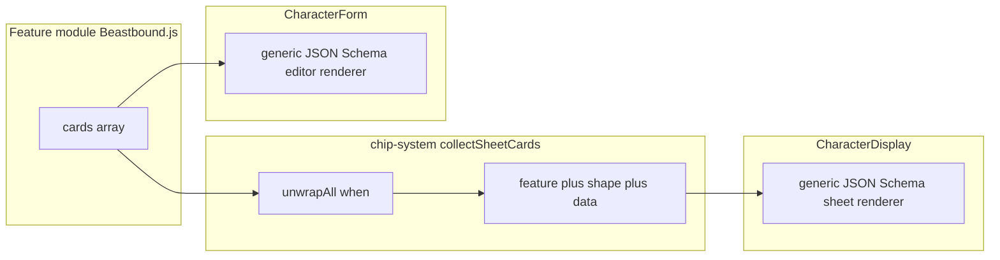

# Declarative sheet + editor cards and SRD-like shape specs

## Current state (why this is needed)

- **Engine** [`collectSheetCards`](src/features-v2/engine/chip-system.js) already evaluates `feature.cards` with `when()` and pushes `{ feature, card }`. Card leaves are **opaque** to the engine (good).
- **Sheet UI** [`CharacterDisplay.jsx`](src/client/components/CharacterDisplay.jsx) special-cases **`card.template === RANGER_COMPANION_SHEET_CARD_TEMPLATE`** (Symbol from [`Beastbound.js`](src/features-v2/subclasses/Beastbound.js)) to render [`CompanionSheet`](src/client/components/CharacterDisplay.jsx) — **to be removed** in favor of a **JSON Schema–driven generic renderer** (§3.3).
- **Editor** [`CharacterForm.jsx`](src/client/components/forms/CharacterForm.jsx) embeds a large **Beastbound-only** companion block (name/species/attack/experiences). It currently sits **above** the Subclass row; your target UX is **under the relevant source selector** (e.g. after Subclass).

**Chip `placements` vs declarative `cards`:** The authoring guide documents chip placements including `'create'` for “character creation” ([`docs/feature-authoring-guide.md`](docs/feature-authoring-guide.md) §3.2), but that path is **not** the same as declarative **`cards`**. New **`cardPlacement`** values (`sheet` | `editor`) apply only to the **`cards`** array and avoid overloading chip phase names.




## 1. Card entry schema (author-facing API)

**Normalize** each `cards[]` entry so the engine and clients share one structure:


| Field       | Purpose                                                                                                               |
| ----------- | --------------------------------------------------------------------------------------------------------------------- |
| `placement` | `'sheet'` \| `'editor'` (default `'sheet'` for legacy bare entries)                                                   |
| `shape`     | **Shape bundle** (object, see §2): `id`, `bind`, `anchors`, `jsonSchema` — **only** defined here; engine resolves shapes **only** from merged `feature.cards` (§2.6) |
| `resolve`   | Existing leaf: `when(...)`, plain object, or `(table) => object` — **only evaluated for matching placement** (see §3) |


**Example** (on the existing **`Companion`** feature object — the repo uses named exports from [`subclasses/index.js`](src/features-v2/subclasses/index.js)). The **shape bundle is not a separate public export**: define it **once** as a file-local `const` in the same module as the feature (e.g. [`Beastbound.js`](src/features-v2/subclasses/Beastbound.js)), then reference it on each `cards[]` entry. **Do not** add a barrel `export { … }` from `src/features-v2/shapes/` for authors to import — the engine must obtain shapes **only** from **`cards`** on loaded features (§2.6).

```js
// Same file as Companion — companionShape is NOT exported from this module.
const companionShape = {
  id: 'dh.shape.rangerCompanion',
  version: 1,
  bind: { kind: 'character', path: 'companion' },
  anchors: { afterSelector: 'subclassId' },
  jsonSchema: { /* see §2.3 — author-facing minimal schema */ },
};

export const Companion = {
  name: 'Companion',
  description: '…',
  cards: [
    {
      placement: 'sheet',
      shape: companionShape,
      resolve: when((t) => t.me?.companion != null, (table) => srdifyRangerCompanion(table.me.companion)),
    },
    {
      placement: 'editor',
      shape: companionShape,
      resolve: when(() => true, () => ({})), // editor binds via shape.bind
    },
  ],
};
```

**Deprecation:** Stop emitting **`template: Symbol`** in `srdifyRangerCompanion`; emit resolved **data** plus **`shapeId`** (the bundle’s `id`). The **sheet** passes **`jsonSchema` + data** into the **shared** renderer (see §3.3).

**Visibility (sheet vs editor):** Do **not** encode in the schema. Use **`placement: 'sheet'`** vs **`'editor'`** on **`cards`** entries and **`when()`** on **`resolve`** so fields that only exist at runtime (e.g. `currentStress`) appear only on the sheet card.

## 2. Shape specification: JSON Schema + small metadata bundle

**Payload structure** (the “fields spec” with bounds, nested arrays, required columns) is defined with **JSON Schema** — e.g. `{ name: 'Tier', type: 'number', bounds: [1,4] }` becomes `"tier": { "type": "integer", "minimum": 1, "maximum": 4, "title": "Tier" }` under `properties`. Use **draft 2020-12** or **draft-07** for tooling compatibility.

A **shape bundle** (file-local `const` next to the feature — **not** a separately exported module) wraps:

1. **`id`** — stable string, e.g. `dh.shape.rangerCompanion` (carried on resolved card payloads as **`shapeId`**).
2. **`version`** — integer; bump when schema or presentation contract changes.
3. **`jsonSchema`** — **required**: the author-authored JSON Schema fragment describing the object at **`bind.path`**. For our use cases the payload is **always a single object**; authors **do not** write root-level **`type: "object"`**, **`title`**, or **`$id`** — if a validator library (e.g. Ajv) needs them, the **engine or client bootstrap** wraps the fragment with `{ type: 'object', … }` and injects **`$id`** / **`$schema`** when compiling (§2.3).
4. **`bind`** — `{ kind: 'character', path: 'companion' }` (dot path under saved character JSON).
5. **`anchors`** — optional, e.g. `{ afterSelector: 'subclassId' }` for `CharacterForm` insertion order.

**Display order:** Follow **`properties` key insertion order** in the author fragment (and nested `properties` inside `items`) — **no** extra ordering keyword.

### 2.1 Custom types (DH vocabulary on top of JSON Schema)

Standard JSON Schema types cover most fields. Two **additional `type` values** are supported for generic renderers (validated/stored without feature-specific branches in the shell):

| Type | Semantics | UI |
| ---- | --------- | --- |
| **`trackedState`** | Same as **`integer`** in memory and in validation bounds (`minimum`, `maximum`, etc.). Represents a **filled count** vs a **max** (e.g. stress marked). | **Tracker** UI (e.g. `CheckboxTrack` / slot strip), **not** a numeric text input. The renderer pairs with a sibling **`max*`** field in the same object when present (e.g. `currentStress` + `maxStress`) to size the track. |
| **`attack`** | Same as **`string`** for storage; adds **attack-line format enforcement** in the editor (and optional display hints on the sheet) for fields that hold weapon/attack names. | String control with validation rules appropriate to attack strings (exact rules TBD in implementation). |

**Bootstrap / validation:** Before `Ajv.compile`, map these to validator-friendly shapes (e.g. `trackedState` → `integer`, `attack` → `string` with `pattern` / custom keyword) so payloads remain plain JSON. **Generic renderers** branch on **`type === 'trackedState'`** / **`type === 'attack'`** when choosing widgets — **not** on feature names or `shapeId`.

### 2.2 Reusable sub-schemas

Use **`$defs`** / **`$ref`** inside the same `jsonSchema` document for nested rows (e.g. experience line item). If **`$ref`** resolution requires a document **`$id`**, the **engine** injects it when assembling the full schema for the validator — authors still author fragments only.

### 2.3 Example: `dh.shape.rangerCompanion` — companion JSON Schema (author-facing)

Concrete schema for Beastbound **`element.companion`** (aligned with current app data). **Authors write** `required` + `properties` (+ nested `items`) only — **not** root **`$id`**, **`type: "object"`**, or **`title`**. Use **`type: "trackedState"`** for `currentStress` and **`type: "attack"`** for `attackName` (§2.1). **`currentStress`** appears only on the **sheet** card via **`placement` + `when()`** on **`resolve`**, not via schema flags.

```json
{
  "required": ["name", "species", "attackName", "experiences"],
  "properties": {
    "name": { "type": "string", "minLength": 1, "title": "Name" },
    "species": { "type": "string", "minLength": 1, "title": "Species" },
    "evasion": {
      "type": "integer",
      "minimum": 0,
      "maximum": 30,
      "default": 10,
      "title": "Evasion"
    },
    "attackName": {
      "type": "attack",
      "minLength": 1,
      "title": "Attack name",
      "description": "d6 Melee in play"
    },
    "maxStress": {
      "type": "integer",
      "minimum": 1,
      "maximum": 10,
      "default": 3,
      "title": "Max stress"
    },
    "currentStress": {
      "type": "trackedState",
      "minimum": 0,
      "title": "Stress (marked)"
    },
    "experiences": {
      "type": "array",
      "minItems": 2,
      "title": "Experiences",
      "items": {
        "type": "object",
        "required": ["name"],
        "properties": {
          "id": { "type": "string" },
          "name": { "type": "string", "minLength": 1, "title": "Experience name" },
          "score": {
            "type": "integer",
            "minimum": 1,
            "default": 2,
            "title": "Score"
          }
        }
      }
    }
  }
}
```

**Bootstrap (implementation, not authored per feature):** Before `Ajv.compile` (or equivalent), wrap the fragment as `{ type: 'object', ...fragment }`, set **`$schema`** / **`$id`** if the validator requires them, then validate payloads.

### 2.4 Optional data normalization (feature module only)

If the schema uses `score` but an import path still has `modifier`, normalize in **`srdifyRangerCompanion`** / save helpers under `src/features-v2/` — **not** in `engine/`.

### 2.5 Tooling

- **Tests:** After the same **bootstrap** wrap as production, Ajv `compile` + `validate` on good/bad companion payloads; or assert on **`Companion.cards[0].shape.jsonSchema`** fixtures.
- **Docs:** Authors reference **JSON Schema** keywords plus **§2.1** custom types (`trackedState`, `attack`) on the **fragment** — only **`jsonSchema`** inside the bundle attached to **`cards`**.

### 2.6 Engine shape discovery (single source of truth)

- The **engine and client** must **not** import shape bundles from a **`shapes/`** barrel or any path outside **`feature.cards[].shape`**.
- After `loadCharacterFeatures` / merge, **collect** shape bundles by walking **`activeFeatures[*].cards[*].shape`** (normalized entries). Deduplicate by **`shape.id`** if the same bundle appears on sheet + editor rows.
- **Tests** may read **`Companion.cards[0].shape`** from the feature module or embed a minimal fixture — they **do not** rely on a public **`export`** of the shape.

---

## 3. Engine + client collection changes

### 3.1 [`chip-system.js`](src/features-v2/engine/chip-system.js)

- Extend **`buildCardsForFeature`** to return normalized entries (internal representation): legacy bare `when`/object → `{ placement: 'sheet', shape: null, resolve: node }`. **Shape bundles** are read **only** from these entries’ **`shape`** field on features — never from a side registry (§2.6).
- **`collectSheetCards`**: filter **`placement === 'sheet'`** (or default), evaluate `resolve` as today.
- Add **`collectEditorCards(features, editorContext)`** (same file or sibling): filter **`placement === 'editor'`**, evaluate `resolve` **only if** you still need `when()`; for static editor shells, `resolve` can be constant.

**Important:** Editor evaluation does **not** use `buildTableSnapshot` the same way. Introduce a small **`buildEditorTableStub(formCharacter)`** in **client** code that exposes `table.me` fields required by any `when()` used on editor cards (mirror [`V2_TABLE_STUB_NO_INSTANCE_ID`](src/client/lib/build-feature-card-model.js)). If the first Beastbound editor card uses **`when(() => true, …)`**, the stub can be minimal.

### 3.2 [`build-feature-card-model.js`](src/client/lib/build-feature-card-model.js)

- **`collectSheetCardsForCharacter`**: either call filtered `collectSheetCards` or filter results — behavior must stay identical for non-Beastbound features.

### 3.3 Sheet rendering ([`CharacterDisplay.jsx`](src/client/components/CharacterDisplay.jsx))

- **No feature-specific sheet templates** — remove **`RANGER_COMPANION_SHEET_CARD_TEMPLATE`** / **`CompanionSheet`** / any `SHAPE_RENDERERS[id]` map in the client shell.
- Implement **one** shared pipeline: e.g. **`renderDeclarativeSheetCard({ jsonSchema, data, shapeId, ctx })`** that walks **`jsonSchema.properties` in insertion order**, maps types to controls: standard **`string` / `integer` / `array`**, plus **`trackedState`** (tracker + `updateFn`) and **`attack`** (roll affordance + attack format where applicable). Wire **`onRoll`**, **`updateFn`**, character **`ctx`** generically from field type + placement — **no** feature names. The **schema** is the only structural spec — no React “template” per shape.
- Feature modules supply **`jsonSchema`** + **`resolve`** output; **CharacterDisplay** stays dumb: schema + data + generic renderer.

### 3.4 Editor rendering ([`CharacterForm.jsx`](src/client/components/forms/CharacterForm.jsx))

- Compute **`activeFeatures`** for the draft character the same way the sheet does (already have **`recomputeCharacter`** / merged features path — reuse; may need a thin helper **`getMergedActiveFeaturesForForm(formData, srdData)`** if not already exposed).
- Call **`collectEditorCards`** → for each row, use the bundle’s **`jsonSchema`** → render **generic field UI** from the schema (same type mapping as §3.3: `string` / `integer` / `array`, plus **`attack`** for constrained string editing, **`trackedState`** where editor exposes a track), bound via **`bind.path`** into `set({ companion: … })`.
- **Remove** the hardcoded Beastbound companion JSX block.
- **Reorder**: render editor cards **`after`** the `FormRow` for **`anchors.afterSelector`** (e.g. Subclass) — moves companion **below** Subclass, matching your UX note (today companion is above Subclass at ~L726 vs Subclass ~L817).

### 3.5 Feature module [`Beastbound.js`](src/features-v2/subclasses/Beastbound.js)

- Define **`companionShape`** as a **file-local** `const` (same module as **`Companion`**); reference it from **`cards`** only — **no** `export` of the shape for other modules to import.
- Update **`srdifyRangerCompanion`** to emit **`shapeId`** + data (no Symbol).
- Split **`cards`** into sheet + editor entries as in §1.

---

## 4. Tests and docs

- **Unit tests:** Update [`test/unit/sheet-cards.test.js`](test/unit/sheet-cards.test.js) for `shapeId` and placement filtering; add **`collectEditorCards`** tests with a stub table; add coverage for the **generic sheet renderer** (JSON Schema + payload — no Symbol, no feature-specific component assertions).
- **Shape tests:** Validate companion payloads against **`Companion.cards[0].shape.jsonSchema`** (after bootstrap wrap) or inline fixtures — **not** a separate exported schema module.
- **Docs:** Update [`docs/feature-authoring-guide.md`](docs/feature-authoring-guide.md) § on `cards`, [`docs/feature-cheatsheet.md`](docs/feature-cheatsheet.md), and **`docs/v2-code-conventions.md`** (CONV entry for card placements + JSON Schema bundles). Per repo rules, also touch [`.cursor/rules/project.mdc`](.cursor/rules/project.mdc) / [`README.md`](README.md) if architecture bullets mention sheet cards. **Include the v2-framework-boundaries clarification** from §5 (templates).

---

## 5. Framework-boundary compliance

- No new Ranger/Beastbound **branches** inside [`src/features-v2/engine/table.js`](src/features-v2/engine/table.js) or action-loop core — only generic **card entry shape** + filtering in [`chip-system.js`](src/features-v2/engine/chip-system.js).
- **Feature-specific templates outside the feature are still a violation.** A “template” means any **dedicated UI** for one feature that lives in shared client/engine code: e.g. a **`CompanionSheet`** component only used by Beastbound, a **`SHAPE_RENDERERS[id] = …`** map keyed by feature-specific ids in `CharacterDisplay`, or `if (shapeId === '…')` branches outside `src/features-v2/`. That couples the app shell to one SRD feature and breaks [`.cursor/rules/v2-framework-boundaries.mdc`](.cursor/rules/v2-framework-boundaries.mdc) the same way engine string branches do.
- **Allowed:** (1) **JSON Schema** + **§2.1** custom types + shape bundle (on **`cards`**, not a public shape export) + **`resolve`** helpers under the feature’s module path (e.g. **`src/features-v2/subclasses/Beastbound.js`**); (2) **generic** renderers that branch on **standard + `trackedState` + `attack`** types only (no feature names in the renderer).
- **Update** [`.cursor/rules/v2-framework-boundaries.mdc`](.cursor/rules/v2-framework-boundaries.mdc) (and/or **CONV-029** in [`docs/v2-code-conventions.md`](docs/v2-code-conventions.md)) to state this explicitly so future work does not reintroduce per-feature sheet components “next to” the engine instead of inside it.

---

## 6. Implementation order (suggested)

1. Add file-local **`companionShape`** in **`Beastbound.js`** (`jsonSchema` with **`trackedState`** / **`attack`** where needed + `bind` + `anchors`); wire **`cards`** sheet + editor with **`when()`** so runtime-only fields resolve only on sheet; **no** exported shape module.
2. Normalize **`cards`** parsing + **`collectSheetCards`** / **`collectEditorCards`** in `chip-system.js`.
3. Implement **generic sheet + editor renderers**: JSON Schema walk + **`trackedState`** / **`attack`** widgets + bootstrap for Ajv; delete **`CompanionSheet`** / Symbol path.
4. Build **generic editor renderer** (same schema walk) + wire **`CharacterForm`** + **reorder** under Subclass.
5. Migrate **`Companion.cards`** + **`srdifyRangerCompanion`**; remove Symbol export usage from client (keep re-export stub deprecated one release if needed).
6. Tests + documentation updates (including **v2-framework-boundaries** / **CONV-029** note on templates).
