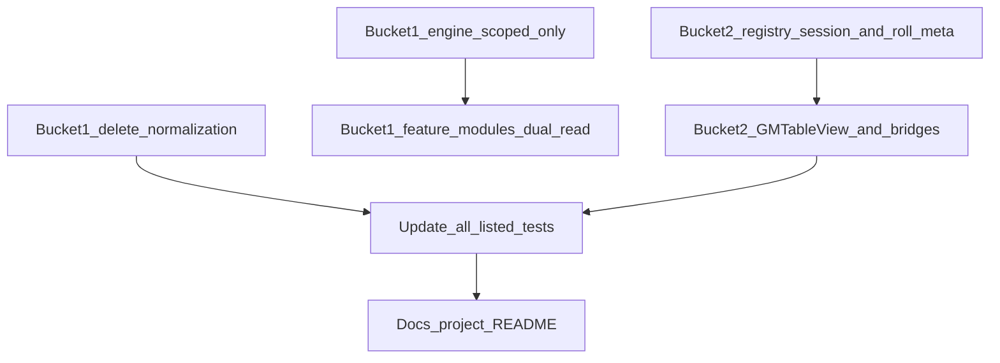

# Legacy + shell decoupling — buckets 1 & 2

## Agent instructions (read first)

- **We are not live.** There is **no** requirement to preserve existing `table_state` rows, character elements, or local dev JSON. **Do not** spend time on backfill scripts, dual-read “transition” periods, or compatibility shims “so old sessions still load.”
- **Proceed:** Implement **breaking** changes. Update unit tests and any **checked-in fixtures** to the new shapes. If something still references legacy keys after your pass, **fix or delete it**—do not leave “Phase 1: find remaining usages” as a follow-up.
- **Agreed canonical decisions** (below) are **locked** for this work—other agents should not re-litigate them unless the product owner explicitly reopens scope.

---

## Agreed canonical decisions

- **Druid beastform**: Single source of truth = `[featureState['classes:srd-cls-druid']](../../src/features-v2/engine/feature-scope-keys.js)` only; **no** `featureState.Beastform`, **no** `featureState.Evolution`. Parallel `**element.activeBeastform`** / `**element.evolutionTraitKey`** are either removed or treated as **single writer** denormalized caches—pick one and make the code consistent (no silent dual paths).
- **Consumables Hopehold / Blinding**: Scoped keys only: `consumables:srd-cns-hopehold-flare`, `consumables:srd-cns-blinding-orb` (see legacy `LEGACY_CONSUMABLE_FLAT_KEYS` in `[normalize-persisted-character-element.js](../../src/client/lib/normalize-persisted-character-element.js)` — remove that legacy path).
- **Warden channel**: `featureState.WardenOfTheElements.channeledElement` only; **no** `element.activeChanneledElement`.

---

## Bucket 1 — Legacy dual paths (every production touchpoint)

### 1. Client normalization (delete)

File: `[src/client/lib/normalize-persisted-character-element.js](../../src/client/lib/normalize-persisted-character-element.js)`

- Remove `**normalizeDruidFeatureState`** (merges `Beastform` / `Evolution` into druid scope).
- Remove `**normalizeConsumableFlatKeys`** and `**LEGACY_CONSUMABLE_FLAT_KEYS`** (`Hopehold Flare`, `Blinding Orb` title keys).
- Remove `**applyLegacyCharacterRuntimeMigrations`** and `[src/features-v2/legacy-character-runtime-migrations.js](../../src/features-v2/legacy-character-runtime-migrations.js)` + registry export (`legacyCharacterRuntimeMigrations`).
- Update `[test/unit/normalize-persisted-character-element.test.js](../../test/unit/normalize-persisted-character-element.test.js)` — delete legacy migration tests.

### 2. Engine: beastform resolution

- `[src/features-v2/engine/beastform-parse.js](../../src/features-v2/engine/beastform-parse.js)` — `**pickActiveBeastformRef`**: remove `mergedFeatureState.Beastform` / `Evolution` branches.
- `[src/features-v2/engine/table.js](../../src/features-v2/engine/table.js)` — `**inBeastform` / active id** (~254–279): remove all `Beastform` / `Evolution` fallbacks.
- `[src/features-v2/engine/feature-loader.js](../../src/features-v2/engine/feature-loader.js)` — `**applyBeastformDeclarativeOverlay`**: remove `mergedFeatureState?.Evolution?.evolutionTraitKey` and align `character.evolutionTraitKey` with § decisions.
- `[test/unit/features-v2/engine/table.test.js](../../test/unit/features-v2/engine/table.test.js)` — remove/update tests that use `gameState.featureState.Beastform`.

### 3. Client stat merge / sheet overlay

- `[src/client/lib/character-calc.js](../../src/client/lib/character-calc.js)` — `**getActiveBeastformIdFromCharacterData`**: remove `fs.Beastform` / `fs.Evolution` branches.
- `[src/client/lib/v2-declarative-sheet.js](../../src/client/lib/v2-declarative-sheet.js)` — overlay only from scoped + resolved row; `[test/unit/v2-declarative-sheet.test.js](../../test/unit/v2-declarative-sheet.test.js)` updates.

### 4. Table ops / DB persistence keys

- `[src/client/lib/table-ops.js](../../src/client/lib/table-ops.js)` — druid `setFeatureState` clears for `element.activeBeastform`: align with § decisions.
- `[src/db.js](../../src/db.js)` — reconcile `activeBeastform` / `evolutionTraitKey` in strip lists with § decisions.

### 5. Feature modules: dual-read fallbacks (legacy title keys)

Remove `table.featureState?.[FS]` / `?? table.featureState?.[SCOPE]`:

- `[src/features-v2/consumables/HopeholdFlare.js](../../src/features-v2/consumables/HopeholdFlare.js)`
- `[src/features-v2/consumables/BlindingOrb.js](../../src/features-v2/consumables/BlindingOrb.js)`
- `[src/features-v2/subclasses/Nightwalker.js](../../src/features-v2/subclasses/Nightwalker.js)`
- `[src/features-v2/subclasses/ElementalOrigin.js](../../src/features-v2/subclasses/ElementalOrigin.js)`
- `[src/features-v2/subclasses/WardenOfTheElements.js](../../src/features-v2/subclasses/WardenOfTheElements.js)`

### 6. Tests using legacy `featureState` shapes

Update or delete fixtures that use `Beastform` / `Evolution` bags or title-key consumables:

- `[test/unit/features-v2/classes/Druid.test.js](../../test/unit/features-v2/classes/Druid.test.js)`
- `[test/unit/features-v2/engine/feature-loader.test.js](../../test/unit/features-v2/engine/feature-loader.test.js)`
- `[test/unit/features-v2/beastforms/beastform-features.test.js](../../test/unit/features-v2/beastforms/beastform-features.test.js)`
- `[test/unit/build-feature-card-model.test.js](../../test/unit/build-feature-card-model.test.js)`
- `[test/unit/character-calc-beastform.test.js](../../test/unit/character-calc-beastform.test.js)`
- `[test/unit/beastform-vtt-drop.test.js](../../test/unit/beastform-vtt-drop.test.js)`

---

## Bucket 2 — Host / VTT shell: remove SRD-named orchestration

### A. Rally session/table clearing

- `[src/client/components/GMTableView.jsx](../../src/client/components/GMTableView.jsx)` — `runSessionStartClear` / `runSessionEndClear`: `featureState?.Rally`, `partyDice`, `maestroRallyChoices`, root `tableFeatureState`; session banner copy.
- `[src/features-v2/classes/Bard.js](../../src/features-v2/classes/Bard.js)` — docs + `Rally` bag usage.
- `[src/features-v2/subclasses/Troubadour.js](../../src/features-v2/subclasses/Troubadour.js)` — `table.featureState?.Rally`, `Virtuoso`.
- `[src/client/lib/table-ops.js](../../src/client/lib/table-ops.js)` — Rally merge comment.

**Target:** registry metadata or generic lifecycle hooks—**no** raw `'Rally'` / `'Virtuoso'` orchestration in `GMTableView`.

### B. Rogue’s Dodge activation from rolls

- `[src/client/components/GMTableView.jsx](../../src/client/components/GMTableView.jsx)` — `_roguesDodgeFeatureStateActivate`, `"Rogue's Dodge"` scope.
- `[src/client/components/CharacterHoverCard.jsx](../../src/client/components/CharacterHoverCard.jsx)` — `feature.name === "Rogue's Dodge"`.

**Target:** roll meta + registry `sourceScopeKey` (no English name in shell).

### C. Warden in bridges / UI

- `[src/client/lib/v2-action-loop-bridge.js](../../src/client/lib/v2-action-loop-bridge.js)` — `WardenOfTheElements.channeledElement`, water branch.
- `[src/client/components/CharacterHoverCard.jsx](../../src/client/components/CharacterHoverCard.jsx)` — `WardenOfTheElements` for `activeChanneledElement`.
- `[src/client/components/GMTableView.jsx](../../src/client/components/GMTableView.jsx)` — `WardenOfTheElements` for `channeled` display.

### D. Reinforced armor VTT mirror

- `[src/client/lib/character-calc.js](../../src/client/lib/character-calc.js)` — `featureState.Reinforced.reinforcedActive`.

### E. Consumable rest bonus (Potion of Stability pattern)

- `[src/client/components/GMTableView.jsx](../../src/client/components/GMTableView.jsx)` — `/^consumables:/` + `restBonusActive`.
- `[src/client/lib/rest-banner-refresh-preview.js](../../src/client/lib/rest-banner-refresh-preview.js)` — same.
- `[src/features-v2/engine/feature-loader.js](../../src/features-v2/engine/feature-loader.js)` — re-include consumables when `restBonusActive`.

### F. Other host literals

- `[src/client/components/GMTableView.jsx](../../src/client/components/GMTableView.jsx)` — `disadvantageSources` `'Shifting'`.
- `[src/client/lib/helpers.js](../../src/client/lib/helpers.js)` — `[isWingsOfLightFlying](../../src/client/lib/helpers.js)` hardcoded feature/chip names.

### G. Comments only (optional cleanup)

- `[src/client/lib/v2-chip-session-view.js](../../src/client/lib/v2-chip-session-view.js)`, `[server.js](../../server.js)`, `[src/features-v2/engine/chip-system.js](../../src/features-v2/engine/chip-system.js)` — Rally examples in comments.

---

## Tests to update (bucket 2 + cross-effects)

- `[test/unit/v2-action-loop-bridge.test.js](../../test/unit/v2-action-loop-bridge.test.js)` — `Rally` / `WardenOfTheElements` fixtures.
- `[test/unit/v2-player-cross-sheet-chip.test.js](../../test/unit/v2-player-cross-sheet-chip.test.js)`
- `[test/unit/features-v2/classes/Bard.test.js](../../test/unit/features-v2/classes/Bard.test.js)`
- `[test/unit/features-v2/subclasses/Troubadour.test.js](../../test/unit/features-v2/subclasses/Troubadour.test.js)`
- `[test/unit/table-ops.test.js](../../test/unit/table-ops.test.js)`
- `[test/unit/feature-get-set-state-display.test.js](../../test/unit/feature-get-set-state-display.test.js)`
- `[test/unit/features-v2/classes/Rogue.test.js](../../test/unit/features-v2/classes/Rogue.test.js)`
- `[test/unit/rest-banner-refresh-preview.test.js](../../test/unit/rest-banner-refresh-preview.test.js)`

---

## Documentation

- `[.cursor/rules/project.mdc](../../.cursor/rules/project.mdc)` — canonical `featureState` + session lifecycle.
- `[README.md](../../README.md)` — if architecture section mentions legacy normalization.
- `[docs/v2-game-table-cutover-remaining.md](../../docs/v2-game-table-cutover-remaining.md)` — mark legacy dual-read removed when touching backlog.

---

## Dependency order

---

## Out of scope

- Renaming **inner** author keys (`partyDice`, `channeledElement`, …) unless bundled with metadata work.
- Preserving **developer** test fixtures that intentionally use old names—**update them** to canonical shapes instead.

