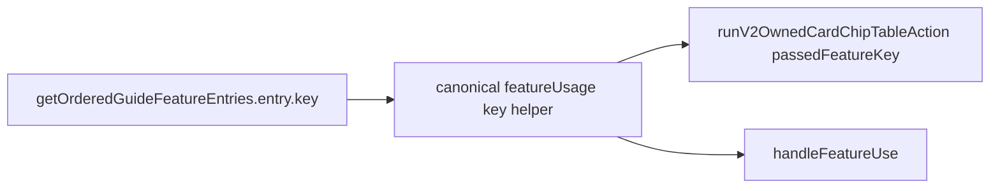

# Plan: Fix split-pipeline bugs (approach #3)

## Problem statement

Mechanical state for **Grant Rally Dice** should be committed in **one** server-visible step: `setFeatureState` mutations (`partyDice`, Troubadour `maestroRallyChoices`) plus `**featureUsage`** for the session, with **no** reliance on GM Ack for usage/costs unless the feature is explicitly defer-style.

Observed issues discussed in-thread:

- **Cancel does not roll back** `postTableOp` (by design). Any exploit (“free dice”) is worsened if **usage** or **costs** are applied on Ack only while `**partyDice` is already persisted**.
- **featureKey** drift between UI paths can leave **featureUsage** under key A while the sheet reads **featureUsage** under key B (Guide uses `entry.key` from `[getOrderedGuideFeatureEntries](src/client/components/CharacterDisplay.jsx)`; other paths use different formulas).

## UX: before and after (Ack vs Cancel)

This section describes player/GM-visible behavior **before** fixing key drift (and related split paths) versus **after** approach #3. It does **not** add defer-until-Ack or cancel rollback; Cancel still leaves `partyDice` on the table.

### Grant (click) — before

- **Rally dice** (`partyDice`) and Troubadour bags can land from engine mutations in one `postTableOp`.
- `featureUsage` may be stored under a **different key** than the Guide row uses (e.g. `Rally-0` vs `class-Rally-0`).
- **Symptoms**: Everyone sees spend/cross-sheet behavior as if Rally fired, but **Grant Rally Dice** can still look **usable**, or the **“already used this session”** state appears **out of sync** with the dice you already handed out—until some other refresh path or Ack-adjacent logic lines up keys.

### Grant (click) — after

- `featureUsage[canonicalKey]` uses the **same** string as **Guide `entry.key`** (via shared helper).
- **Symptoms**: As soon as the click commits, the sheet shows **dice granted** and **Grant correctly disabled / marked used for the session** in one place—no false “I can still click Grant.”

### Ack (GM) — before

- The follow-up **action-loop banner** is mostly **narrative** (`_v2ActionLoop`, not `_featureUse`), so `applyFeatureResources` does not run on Ack for that banner.
- If players expected **Ack to “finalize”** session usage for Rally, that expectation is **not met** by a second persistence step; any **felt** “Ack fixes the badge” may be **accidental** (re-render, key collision) rather than reliable.

### Ack (GM) — after

- **Still no second mechanical commit** for Grant on Ack alone (by design for this approach).
- **UX clarity**: Mechanical state is already correct **right after Grant**; **Ack** means “GM saw the table notification / fiction,” not “now the engine applies Rally.” No surprise **Hope** or **usage** delta on Ack for Grant from a duplicate pipeline.

### Cancel (GM) — before

- `postTableOp` has already run; cancel only clears the **banner queue** row.
- `partyDice` remain (no rollback).
- If `featureUsage` was under a key the Guide did not read, **Grant could still appear available** → second use exploit or confusion (“I canceled—why do we still have dice?”).

### Cancel (GM) — after

- **Still no rollback** of `partyDice` (out of scope for approach #3).
- **Usage is stored under the canonical key**, so **Grant cannot be triggered again this session** even after Cancel—the Bard does **not** get a “free” extra Grant from key drift.
- **Remaining UX truth**: Cancel **drops the notification**, not the **already-applied** table state—players may still have **dice on their sheets** after Cancel; fixing “Cancel undoes the grant” requires **defer** or **explicit rollback** (other approaches).

## Findings (codebase)

1. **Rally action-loop banners** from `[applyV2OwnedCardChipEngineResultToTable](src/client/lib/v2-owned-card-chip-table.js)` do **not** set `_featureUse` (only `_v2ActionLoop`). So `applyFeatureResources` on Ack is **not** triggered by that banner for Rally. The “costs on Ack only” theory is more likely **key mismatch** (used badge / session gating) or **expectation** about Cancel, not a second `_featureUse` pipeline for the same click.
2. **Three different `featureKey` schemes** for the same logical class feature: `[getOrderedGuideFeatureEntries](src/client/components/CharacterDisplay.jsx)` uses `f.id || \`class-${f.name}-${idx}`;` [handleFeatureUse](src/client/components/CharacterHoverCard.jsx)`uses ``${feature.name}-${featureKeyIdx}``;`[runV2OwnedCardChipTableAction](src/client/lib/v2-owned-card-chip-table.js)`defer fallback matches the latter. Guide`[GuideFeatureCard](src/client/components/features/GuideFeatureCard.jsx)`uses`entry.key`— V2 chips use`class-Rally-0`(or stable`id`), legacy/defer can write` Rally-0`.
3. `[applyV2OwnedCardChipEngineResultToTable](src/client/lib/v2-owned-card-chip-table.js)` uses `usageKey = passedFeatureKey || featRow.name`. If `passedFeatureKey` is omitted, `Rally` alone may not match `class-Rally-0`.

## Implementation strategy

### 1. Single canonical helper for “feature usage key”

Add `[src/client/lib/feature-usage-key.js](src/client/lib/feature-usage-key.js)` (or colocate next to `getOrderedGuideFeatureEntries`) that returns the **same string** as the corresponding `getOrderedGuideFeatureEntries` entry `key`. Wire `[CharacterHoverCard.jsx](src/client/components/CharacterHoverCard.jsx)` `handleFeatureUse`, `[v2-owned-card-chip-table.js](src/client/lib/v2-owned-card-chip-table.js)` defer `fk` fallback; grep for duplicates.

### 2. Audit Rally + V2 card chip paths

Confirm `runV2OwnedCardChipTableAction` always receives `passedFeatureKey` matching Guide `entry.key`. Grep Rally / partyDice / featureUsage / applyFeatureResources.

### 3. Tests

Unit tests for key helper; extend `[test/unit/features-v2/classes/Bard.test.js](test/unit/features-v2/classes/Bard.test.js)` for bundled `featureState` + `featureUsage`.

### 4. Documentation

Short CONV note in `[docs/v2-code-conventions.md](docs/v2-code-conventions.md)` or `[docs/feature-cheatsheet.md](docs/feature-cheatsheet.md)`.

## Out of scope (approach #3)

- No `gameTableDeferUntilBannerAck` change for Rally.
- No cancel-time rollback of `table_state`.

## Success criteria

- One canonical `featureUsage` key across Guide, V2 chip, defer fallback, and legacy `handleFeatureUse`.
- Rally Grant: one `update-elements` batch persists `featureState.Rally` (including `partyDice`) and `featureUsage[canonicalKey]` together.

