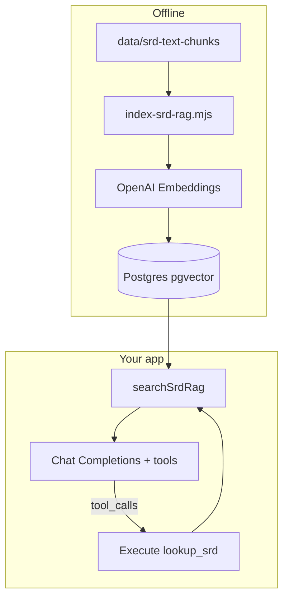

# SRD RAG (simplified): index + local search + Chat Completions tools

## Goal

Support **your code** calling OpenAI **Chat Completions** (or Responses API) with a **`lookup_srd`-style tool** in the request body, plus **system/developer instructions**. When the model returns `tool_calls`, **your server executes search in-process** (same Node process) — no Custom GPT, no Assistants API requirement, no public HTTPS endpoint that OpenAI calls.

Optional later: a **debug** `POST` route behind `requireAuth` that wraps the same function (not required for the tool loop).

---

## 1. Chunk files: remove noise, keep metadata

- Edit [`scripts/chunk-srd-readme.mjs`](scripts/chunk-srd-readme.mjs): **remove** the HTML comment block from `buildFileContent`. Keep YAML frontmatter + markdown body.
- Shorten the script file header comment if needed.
- Run `npm run chunk:srd` to regenerate [`data/srd-text-chunks/`](data/srd-text-chunks/).

---

## 2. Indexing pipeline

**Embedding model (default):** `text-embedding-3-small` (1536 dims); use existing `OPENAI_API_KEY` + `fetch` pattern ([`src/llm-character-builder.js`](src/llm-character-builder.js)).

**String to embed per chunk:**

```text
Context: <breadcrumb from YAML>

<body markdown>
```

**DB:** Migration: enable **pgvector** + table `srd_rag_chunks` (`id`, `embedding vector(1536)`, JSONB or text columns for breadcrumb, body, source filename, part fields). Add a vector index (HNSW/IVFFlat per host support).

**Script:** `scripts/index-srd-rag.mjs` + `npm run index:srd-rag` — read all chunk files, upsert idempotently.

**Env:** `OPENAI_API_KEY`, optional `OPENAI_EMBEDDING_MODEL`, `DATABASE_URL`.

---

## 3. Runtime search (core deliverable)

Implement **`searchSrdRag(query, { topK, chapter? })`** in e.g. [`src/srd-rag/`](src/srd-rag/) or [`src/server/srd-rag.js`](src/server/srd-rag.js):

1. Embed `query` with the **same** model as indexing.
2. Query Postgres for nearest neighbors; return ranked rows with breadcrumb, body (or excerpt), optional score.

**Tool execution path:** whatever code handles your agent loop calls **`searchSrdRag`** directly when the model requests `lookup_srd` — **no** round-trip to a public URL for OpenAI.

---

## 4. Documentation (minimal)

Add something like [`docs/srd-rag-tool.md`](docs/srd-rag-tool.md):

1. **Tool definition** — JSON Schema for `lookup_srd` (`query`, optional `top_k`) to paste into `tools` in Chat Completions.
2. **Instructions** — short system prompt guidance (use tool for rules text; prefer citing retrieved content).
3. **Tool loop** — pseudocode: `messages` + `tools` → if `tool_calls`, run `searchSrdRag`, append `tool` messages, call again until final `content`.

No Custom GPT / Assistants / Actions sections unless you add them yourself later.

---

## 5. Tests + project docs

- Unit tests: embed-string construction from a fixture chunk; optional search with mocked DB.
- Update [`README.md`](README.md) and [`.cursor/rules/project.mdc`](.cursor/rules/project.mdc): `index:srd-rag`, env vars, link to `docs/srd-rag-tool.md`.

---

## Architecture



---

## Optional later

- Hybrid BM25 + vector.
- Authenticated HTTP search route for manual testing only.
- Public endpoint + secret only if a **remote** caller must hit search (not needed for the in-process tool loop).
