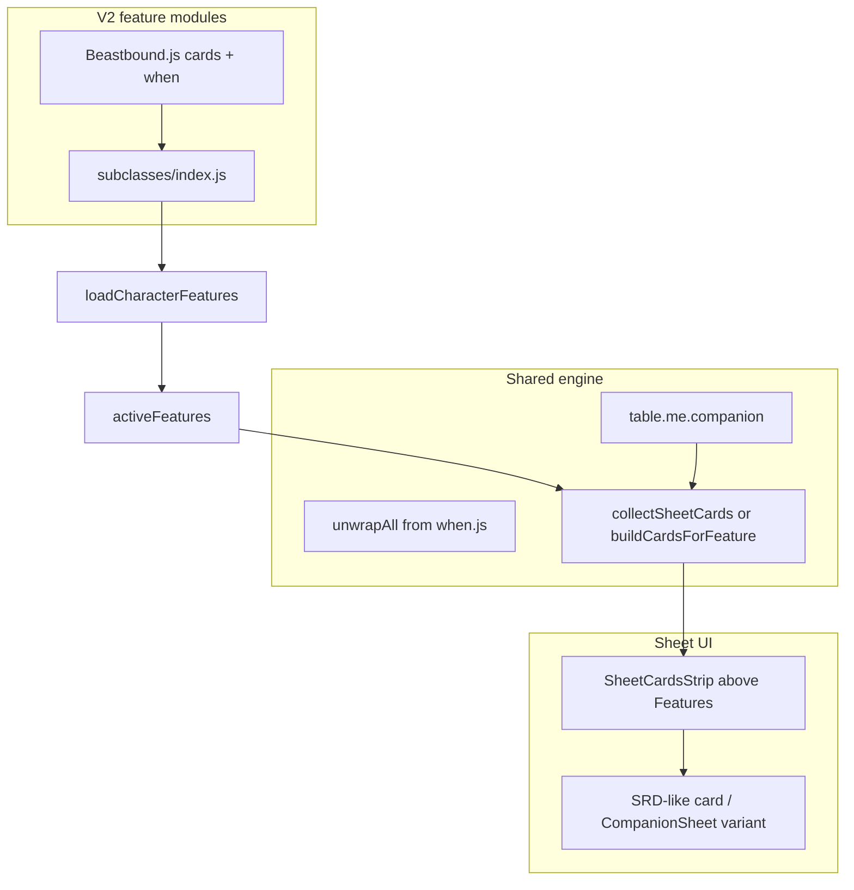

# Declarative sheet cards and Beastbound companion migration

## Current state

- **Data**: Beastbound PCs store `el.companion` (name, species, evasion, stress, experiences, attack, etc.) from [src/client/components/forms/CharacterForm.jsx](src/client/components/forms/CharacterForm.jsx) and table ops in [src/client/lib/table-ops.js](src/client/lib/table-ops.js) / [GMTableView.jsx](src/client/components/GMTableView.jsx).
- **Presentation (to replace)**:
  - [CharacterDisplay.jsx](src/client/components/CharacterDisplay.jsx): `CharacterCompanion` (compact), `CompanionSheet` (card-style), and `CharacterDetailPane` stacking `CompanionSheet` below the main sheet.
  - [CharacterHoverCard.jsx](src/client/components/CharacterHoverCard.jsx): `CharacterCompanion` after abilities; `hideCompanionSection` prop.
  - [GMTableView.jsx](src/client/components/GMTableView.jsx): **second card to the right of the sheet** — when `liveEl.companion` is set, a fixed `flex-row` overlay widens the layout: the main hover/pinned sheet column **narrows** (`hasCompanion ? 'min(44rem, calc(100vw - 15rem - 14rem - 16px))' : …`) and a `**14rem`** side column renders [CompanionSheet](src/client/components/CharacterDisplay.jsx) (`queueManualTrackEdit` / `updateActiveElement` for stress). **This entire branch must be removed** once companion is shown only via declarative cards **inside** the main sheet (above Features). Table mechanics (`companion` merges, `_companionExperienceForRoll`, etc.) stay; only this extra column and its layout math go away.
- **Engine**: [src/features-v2/subclasses/Beastbound.js](src/features-v2/subclasses/Beastbound.js) already has **hooks** (e.g. Battle-Bonded) that use `table` predicates; there is **no** `companion` field on `table.me` today ([table.js](src/features-v2/engine/table.js) exposes `classId` / `subclassId` but not companion payload). Predicates for sheet-only `when()` need read-only access to companion data without Ranger-specific branching in `table.js` beyond exposing generic character fields.

## Target architecture

1. `**cards` on feature objects** (same spirit as `chips`):
  - `feature.cards` is an array of `when(...)` wrappers and/or plain leaves.
  - **Leaf shape**: SRD-like display objects the renderer understands—e.g. `{ name, description, tier?, type?, attack?, ... }`—and/or a **function** `(table) => object` that returns that shape (for companion stats from `table.me.companion`).
  - **No** subclass-specific logic in `engine/table.js` beyond adding `**companion: element.companion ?? null`** (and optionally a short JSDoc) on character `table.me` so `when((t) => !!t.me?.companion, …)` and subclass checks `t.me?.subclassId === 'srd-sub-beastbound'` work. This is generic “expose persisted character payload,” not a Beastbound fork in the engine.
2. **Collection / unwrapping** (mirror [chip-system.js](src/features-v2/engine/chip-system.js)):
  - Add something like `buildCardsForFeature(feature)` → returns `feature.cards` array (or `[]`).
  - Add `collectSheetCards(features, table)` (or equivalent): for each merged `activeFeatures` row, `unwrapAll` each card leaf with the same `table` snapshot used for chips ([buildGuideFeatureTableSnapshot](src/client/lib/build-feature-card-model.js)); skip null; if leaf is function, call it with `table` and normalize to a plain object.
  - **Chip synthesis guard**: extend [buildChipsForFeature](src/features-v2/engine/chip-system.js) so a feature that **only** contributes `cards` (and no interactive default action) does **not** fall through to the synthetic **narrative-only** chip. Concretely: if `Array.isArray(feature.cards) && feature.cards.length`, treat like other declarative-only rows (return `[]` unless explicit `chips` exist), or add `cards` to [hasDeclarativeSheetRepresentation](src/features-v2/engine/chip-system.js).
3. **Beastbound subclass module** ([Beastbound.js](src/features-v2/subclasses/Beastbound.js)):
  - Extend the existing **`Companion`** feature object (or add a dedicated sheet-cards-only export if splitting reads cleaner), with:
    - `name` / minimal `description` (canonical SRD text stays in **Features**; cards are the runtime stat presentation).
    - `cards: [ when( beastboundAndHasCompanion, companionCardFactory ) ]` where predicates use `table.me.subclassId` and `table.me.companion`.
    - `companionCardFactory(table)` returns one (or more) SRD-shaped object(s) built from `table.me.companion` (name, species, evasion, stress line, attack summary, experiences list—matching what `CompanionSheet` shows today).
  - **Registration**: [src/features-v2/subclasses/index.js](src/features-v2/subclasses/index.js) under **`'srd-sub-beastbound'`** (Beastbound’s `features` array), not the Ranger class file—so [loadCharacterFeatures](src/features-v2/engine/feature-loader.js) merges it for Beastbound Rangers only.
4. **Guide / Features list duplication**:
  - The **`Companion`** registry row remains the canonical **text** in the Features section (SRD Beastbound subclass). Sheet-card plumbing must **not** add a duplicate “Companion” line in guide UIs—if any path lists **all** `activeFeatures` as guide rows, add an opt-out flag on the feature object (e.g. `sheetCardsOnly: true` or `hideInGuideFeatureList: true`) and respect it wherever guide entries are built. (Class-level `Ranger.js` is **not** where this lives.)
5. **Sheet UI placement**:
  - In [CharacterFeaturesPanel](src/client/components/CharacterDisplay.jsx), **above** the existing `CharacterSheetEmphasisCard title="Features"` (and above Actions when split): render a new strip component, e.g. `CharacterSheetDeclarativeCards`, that:
    - Calls `collectSheetCards(el.activeFeatures, table)` with `buildGuideFeatureTableSnapshot` / `v2TableContext` parity used elsewhere.
    - Maps each resolved item through a small presenter: prefer reusing patterns from [LibraryItemDisplayContent.jsx](src/client/components/library/LibraryItemDisplayContent.jsx) for generic SRD shapes; for companion runtime, use a **variation** that wraps or reuses existing [CompanionSheet](src/client/components/CharacterDisplay.jsx) so GMTableView-level interactions (stress, attacks) can still be passed via props when `interactionMode === 'interactive'` and `updateFn` / `queueManualTrackEdit` exist.
  - Remove standalone `**CharacterCompanion`** / bottom `**CompanionSheet`** from [CharacterDetailPane](src/client/components/CharacterDisplay.jsx) and the `**CharacterCompanion`** block from [CharacterHoverCard.jsx](src/client/components/CharacterHoverCard.jsx) once the strip covers those surfaces (or gate old components behind a single compatibility flag during transition—prefer clean cut per your preference).
6. **GMTableView**:
  - Thread the same `CharacterSheetDeclarativeCards` (or props into `CharacterFeaturesPanel`) so the pinned sheet + hover use one code path.
  - **Remove** the dedicated right-hand companion column: delete `hasCompanion`-gated flex layout, `14rem` companion wrapper, and main-column width reduction (~lines 5798–5910 area; search `hasCompanion` / `CompanionSheet`). After removal, the overlay should be a **single** main sheet column (same max width as non-companion characters).
  - Keep existing table ops for `companion` stress / `_companionExperienceForRoll`; wire those behaviors through the **in-sheet** declarative companion card (interactive variant), not a sibling column.
7. **Tests** (policy: regression coverage):
  - Unit-test `collectSheetCards` / unwrap with a stub `table` and a minimal Beastbound **`Companion`**-shaped feature (or equivalent export from [Beastbound.js](src/features-v2/subclasses/Beastbound.js)).
  - Optional: snapshot or assert resolved SRD-like object keys from `companion` fixture.
8. **Documentation** (when implementing—per project rules):
  - [docs/feature-cheatsheet.md](docs/feature-cheatsheet.md) and [docs/v2-code-conventions.md](docs/v2-code-conventions.md) (CONV-029): document `cards`, leaf shapes, `table.me.companion`, and the opt-out flag for guide listing.
  - [docs/feature-authoring-guide.md](docs/feature-authoring-guide.md): short subsection on sheet cards vs chips.

## Out of scope (your followups)

- Redesigning how Ranger/Beastbound content appears in the **character editor** (`CharacterForm` companion section).
- Removing `rangerFocusToggle` legacy bridge in [GuideFeatureCard.jsx](src/client/components/features/GuideFeatureCard.jsx) (separate from companion).

## Risk / design choice

- **Interactive companion** on the Game Table must remain usable: the declarative card renderer should accept optional callbacks (stress change, attack roll) keyed off a reserved field on the resolved card object (e.g. `_interaction: 'beastboundCompanion'`) interpreted only in React—**not** in the engine—keeping framework boundaries clean.
